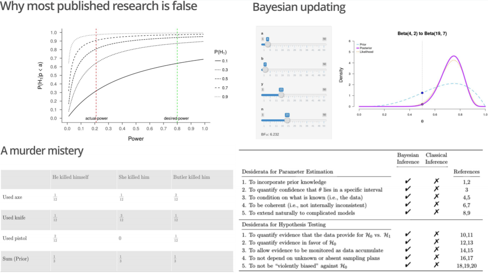

# An Introduction to (Bayesian) Statistics

This two hour workshop will be presented at the 31st EFPSA Congress in Qakh, Azerbaijan. You can view the slides online [here](https://fdabl.shinyapps.io/slides).

> Most students dislike statistics not because it's hard, but because it's unintuitive or even confusing. And it's true: classical statistical concepts such as the *p*-value and confidence intervals are exceptionally difficult to grasp; for students and statisticians alike. However, statistical inference is the universal tool of science, and a good scientist must have a good command of it. Eschewing the standard way of teaching statistics in psychology, i.e., introducing loosely connected tests in a cookbook-oriented fashion, in this workshop, I provide an introduction to statistics from "first principles". I discuss its exciting history, controversies, and enigmatic key players. After introducing probability as the means to quantify uncertainty, I focus on the role of statistical modeling. On a real-life example, I illuminate the problems of parameter estimation, hypothesis testing, and model prediction both from a classical and Bayesian perspective. This allows me to (re)introduce you to concepts such as maximum likelihood, confidence intervals, and *p*-values, as well as outline a more intuitive and powerful approach to statistics --- the Bayesian approach. In the last, practical segment we use JASP (https://jasp-stats.org) to apply Bayesian principles to data sets from real research. All materials including slides, code, and further resources will be made available at https://github.com/fdabl/Intro-Stats. Note that there are no prerequisites for this workshop. All that you need to bring is a laptop and a focused mind!

## Preview

## Further resources
- Papers
    - Bayesian Inference for Psychology. Part I and II ([2017](https://osf.io/m6bi8/)) by Wagenmakers et al.
    - Bayesian Benefits for the Pragmatic Researcher ([2016](http://journals.sagepub.com/doi/pdf/10.1177/0963721416643289)) by Wagenmakers, Morey, and Lee
    - How to become a Bayesian in eight easy steps ([2016](https://osf.io/8wkpd/)) by Etz, Gronau, Dablander, Edelsbrunner, and Baribault
    - The philosophy of Bayes factors and the quantification of statistical evidence ([2016](https://www.sciencedirect.com/science/article/pii/S0022249615000723)) by Morey, Romeijn, & Rouder
    - Statistical tests, *p*-values, confidence intervals, and power: a guide to misinterpretations ([2016](https://link.springer.com/article/10.1007/s10654-016-0149-3)) by Greenland et al.
- Textbooks
    - Statistical Rethinking ([2016](http://andrewgelman.com/2016/01/15/mcelreaths-statistial-rethinking-a-bayesian-course-with-examples-in-r-and-stan/)) by McElreath
    - Introduction to Probability ([2014](https://www.crcpress.com/Introduction-to-Probability/Blitzstein-Hwang/p/book/9781466575578)) by Blitzstein & Hwang
    - Bayesian Cognitive Modeling ([2013](https://bayesmodels.com/)) by Lee & Wagenmakers
- Popular Science Books
    - Statistics Done Wrong ([2015](https://www.statisticsdonewrong.com/)) by Alex Reinhart
    - Superforecasting ([2016](https://www.goodreads.com/book/show/23995360-superforecasting)) by Tedlock & Gardner
    - The Theory that would not die ([2011](http://www.mcgrayne.com/the_theory_that_would_not_die__how_bayes__rule_cracked_the_enigma_code__hunted_d_107493.htm)) by McGrayne
    - The Seven Pillars of Statistical Wisdom ([2016](https://www.goodreads.com/book/show/27311742-the-seven-pillars-of-statistical-wisdom)) by Stephen Stigler
- Blogs
    - [The Etz-Files](https://alexanderetz.com/) by Alexander Etz
    - [The 20% Statistician](https://daniellakens.blogspot.de/) by Daniel Lakens
    - [Statistical Modeling, Causal Inference, and Social Science](http://andrewgelman.com/) by Andrew Gelman
- Further resources
    - [Exercises](https://github.com/fdabl/Intro-Stats/blob/master/exercises/exercises.pdf) for this workshop
    - [A First Lesson in Bayesian Inference](http://lmpp10e-mucesm.srv.mwn.de:3838/felix/BayesLessons/BayesianLesson1.Rmd) by Eric-Jan Wagenmakers
    - [Improving your statistical inferences](https://www.coursera.org/learn/statistical-inferences/home/welcome) by Daniel Lakens