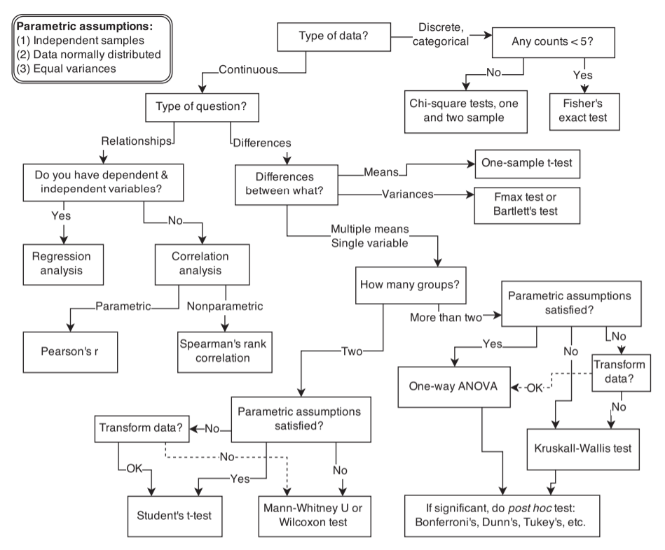
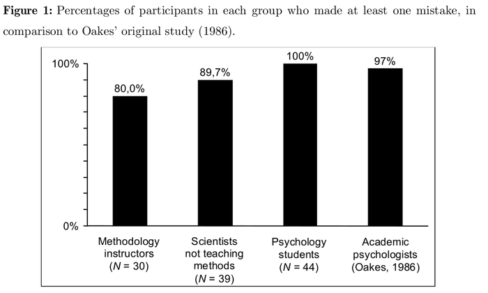
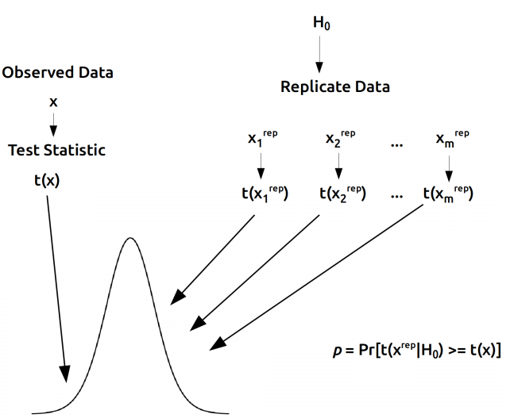
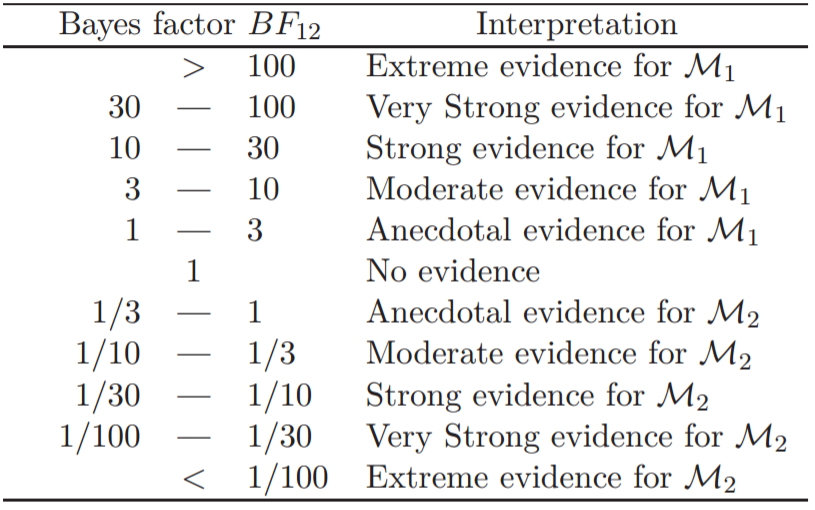
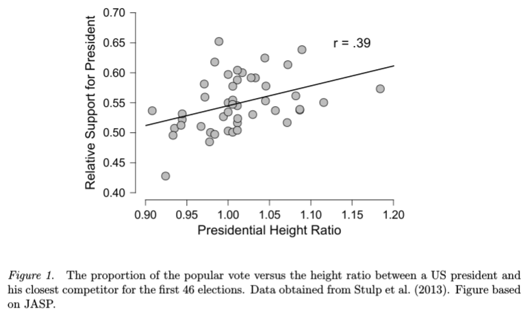
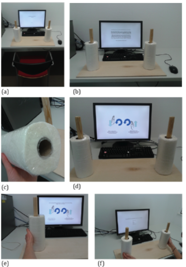
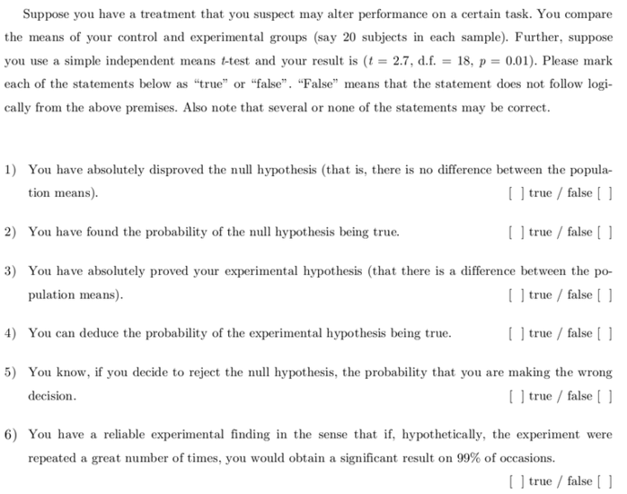
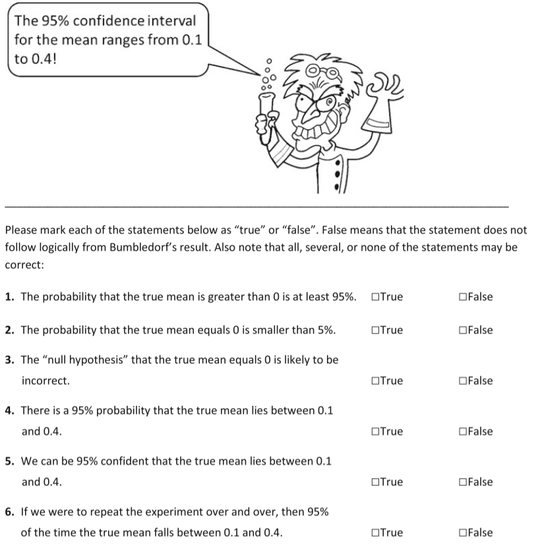
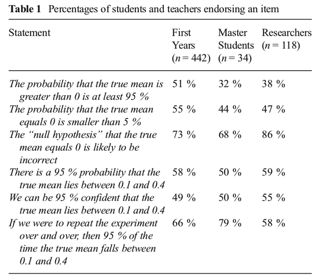

```{r setup, include=FALSE, echo = FALSE, message = FALSE}
knitr::opts_chunk$set(echo = TRUE, warning = FALSE, message = FALSE, dev.args = list(bg = 'transparent'), fig.split = 'center')
```

<!-- \usepackage{csquotes} -->
<!-- \newcommand{\param}{\mathbf{\theta}} -->
<!-- \newcommand{\dat}{\textbf{y}} -->
<!-- \newcommand{\cmark}{\ding{51}} -->
<!-- \newcommand{\xmark}{\ding{55}} -->

## Motivation: Against teaching standards


## Motivation: Against null rituals
- Current statistical practice is a hybrid between the approaches of Fisher and Neyman-Pearson
- Gigerenzer (2004) introduces the term "null ritual" to denote current practices

<span style = "color:white"></span>

- **(1)** Setup a statistical null hypothesis, but do not specifiy your own hypothesis nor any alternative.
- **(2)** Use the 5% significance level for rejecting the null and accepting your hypothesis.
- **(3)** Always perform this procedure.
    
    
## Learning outcomes
- **Oblique**
    - Get a feeling for *statistical modeling*
    - Get a feeling for statistics as a (young) discipline
- **Concrete**
    - Be able to state the differences between classical and Bayesian statistics
    - Be able to apply simple Bayesian models to your data
- **Wishful**
    - Become hungry for statistical developments
    - Read the linked resources at https://github.com/fdabl/Intro-Stats to dive deeper


## Outline
- **1a.** Historical context for statistics
    - Different statistical philosophies
    - The superego, ego, and the id in statistical reasoning
    
<span style = "color:white"></span>

- **1b.** Examples in probability
    - A murder mystery
    - Why most published research is false
    - Do I have testicular cancer?

<span style = "color:white"></span>
    
- **2.** Foundation: Statistical models
    - Breakfast example
    
<span style = "color:white"></span>
    
- **3.** Classical statistics
    - Maximum likelihood, sampling distributions, bootstrapping
    - Confidence intervals, $p$-values

## Outline
- **4.** Introduction to Bayesian statistics
    - Parameter estimation
    - Model comparison
    - Model prediction
    
<span style = "color:white"></span>

- **5.** Practical examples using JASP
    - Is height associated with being president?
    - *~ ~ tralala ~ ~ ... Wish we could turn back time .. ~ ~ tralala ~ ~*
    
<span style = "color:white"></span>
    
- **6.** Final thoughts and further resources

# Historical context

## Overview
- Before 1940, significance testing was virtually non-existent
- By 1955, 80% of empirical articles reported significance tests
- Today, the figure is close to 100% (see Gigerenzer, 1993)

<span style="color: white;"></span>

<span style = "font-size: 1.4em; line-height: 120%; margin-top: -800px;">
"[Statisticians] have already overrun every branch of science with a rapidity of conquest rivalled only by Atilla, Mohammed, and the Colorado beetle."

- Kendall (1942, p.69)
</span>


## Ronald Fisher
<div style = "float:left; width:40%;">

</div>
<div style = "float:right; width:55%;">
- Father of modern statistical inference
- Randomization, design of experiments
- $p$-value, $\alpha$ level, null hypothesis, analysis of variance
- Maximum likelihood, sexy son hypothesis
</div>


## Ronald Fisher: Evidential statistics
<span style = "font-size: 1.5em; line-height: 120%; margin-top: -800px;">
"... no scientific worker has a fixed level of significance at which from year to year, and in all
circumstances, he rejects hypotheses; he rather gives his mind to each particular case in the light of his evidence and his ideas."

- Sir Ronald A. Fisher (1956)
</span>


## Neyman-Pearson
- Jerzy Neyman (1894 - 1981) was a polish man who did much of his work in the United States
- Egon Pearson (1895 - 1980) was the son of the eminent Karl Pearson
- Together, they put Fisher's ideas on a rigorous mathematical basis
- Fisher didn't like it, and a personal feud began that lasted until his death

<span style = "color: white;"></span>

- Some concepts they introduced were
    - The alternative hypothesis
    - Type I ($\alpha$) and Type II ($\beta$) errors
    - Statistical power
    - Confidence intervals
    - Decision theoretic foundation of hypothesis testing


## Neyman-Pearson: Behavioural statistics
<span style = "font-size: 1.5em; line-height: 120%; margin-top: -500px;">
"We are inclined to think that as far as a particular hypothesis is concerned, no test based upon the theory of probability can by itself provide any valuable evidence of the truth or falsehood of that hypothesis. But we may look at the purpose of tests from another viewpoint. Without hoping to know whether each separate hypothesis is true or false, we may search for rules to govern our behaviour with regard to them, in following which we insure that, in the long run of experience, we shall not be too often wrong".

- Jerzy Neyman & Egon Pearson (1933, pp. 290-291, as quoted in Johansson, 2011)
</span>


## Current statistical practice: Hybrid
- The "null ritual" (Gigerenzer, 2004)
- This is in part due to considerable misunderstandings of statistics
- Oakes (1986); Wulff et al. (1987); Haller & Krauss (2002); Lecoutre et al. (2003); Hoekstra et al. (2014)

<center>
  
</center>


## Bayes-Laplace-Jeffreys
- Thomas Bayes (1701 - 1761) was a Presbyterian minister whose "An essay towards solving a Problem in the Doctrine of Chances" used inverse probability --- Bayes' rule

<span style = "color:white"></span>

- Pierre-Simon Laplace was the "Newton of France"
    - Among many other things, generalized Bayes' rule and proved the central limit theorem

<span style = "color:white"></span>

- Harold Jeffreys (1891 - 1989) revived the Bayesian view of probability
    - Developed the Bayes factor, default Bayesian hypotheses tests, and Jeffreys priors
    
<span style = "color:white"></span>

- Use Bayes' rule to make uncertainty statements about parameters, models, and hypotheses
- (This is not possible in any other statistical approach)


##
<center>
  
</center>


# Examples in Probability

## A murder mystery
- A scream wakes you
- You run in the kitchen and see a dead body --- who killed your husband?

<span style = "color:white"></span>

- There are three possible perpetrators
    - Your husband himself
    - The person he had an affair with
    - The butler

<span style = "color:white"></span>

- There are three possible murder weapons
    - An axe
    - A knife
    - A pistol
    
- How should you proceed?
- Instinctively, you sketch a probability table

## A murder mystery
+-----------------------+-------------------------------+--------------------------+-----------------------------+
|                       |$\text{He killed himself}$     |  $\text{She killed him}$ | $\text{Butler killed him}$  |
+-----------------------+-------------------------------+--------------------------+-----------------------------+
| $\text{Used axe}$     |  $\frac{1}{12}$               | $\frac{1}{12}$           | $\frac{2}{12}$              |
+-----------------------+-------------------------------+--------------------------+-----------------------------+
| $\text{Used knife}$   |  $\frac{1}{12}$               | $\frac{3}{12}$           | $\frac{1}{12}$              |
+-----------------------+-------------------------------+--------------------------+-----------------------------+
| $\text{Used pistol}$  |  $\frac{2}{12}$               | $0$                      | $\frac{1}{12}$              |
+-----------------------+-------------------------------+--------------------------+-----------------------------+
| $\text{Sum (Prior)}$  |  $\frac{1}{3}$                | $\frac{1}{3}$            | $\frac{1}{3}$               |
+-----------------------+-------------------------------+--------------------------+-----------------------------+


## Two types of probability
- **Joint probability**

$$
P(\text{Axe}, \text{Suicide}) = \frac{1}{12}
$$
- **Marginal probability**

$$
\begin{split}
P(\text{Suicide}) &= \frac{1}{3} \\[1ex]
                            &= P(\text{Axe}, \text{Suicide}) +  P(\text{Knife}, \text{Suicide}) + P(\text{Pistol}, \text{Suicide}) \\[1ex]
                            &= \frac{1}{12} + \frac{1}{12} + \frac{2}{12} \\[2ex]
                            &\Rightarrow \sum_{W}^{3} P(W, \text{Suicide}) \qquad \text{Sum rule}
\end{split}
$$


## A murder mystery
- You estimated that each person was equally likely to be the perpetrator
- Now the police has indentified the murder weapon --- an axe, of course
- How does that change your beliefs?
- Who is most likely to have killed your husband?


## Model specification
+-----------------------+-------------------------------+--------------------------+-----------------------------+
|                       |$\text{He killed himself}$     |  $\text{She killed him}$ | $\text{Butler killed him}$  |
+-----------------------+-------------------------------+--------------------------+-----------------------------+
| $\text{Used axe}$     |  $\frac{1}{12}$               | $\frac{1}{12}$           | $\frac{2}{12}$              |
+-----------------------+-------------------------------+--------------------------+-----------------------------+
| $\text{Used knife}$   |  $\frac{1}{12}$               | $\frac{3}{12}$           | $\frac{1}{12}$              |
+-----------------------+-------------------------------+--------------------------+-----------------------------+
| $\text{Used pistol}$  |  $\frac{2}{12}$               | $0$                      | $\frac{1}{12}$              |
+-----------------------+-------------------------------+--------------------------+-----------------------------+
| $\text{Sum (Prior)}$  |  $\frac{1}{3}$                | $\frac{1}{3}$            | $\frac{1}{3}$               |
+-----------------------+-------------------------------+--------------------------+-----------------------------+


## It was an axe! --- data arrive
+-----------------------+-------------------------------+--------------------------+-----------------------------+
|                       |$\text{He killed himself}$     |  $\text{She killed him}$ | $\text{Butler killed him}$  |
+-----------------------+-------------------------------+--------------------------+-----------------------------+
| $\text{Used axe}$     |  $\frac{1}{12}$               | $\frac{1}{12}$           | $\frac{2}{12}$              |
+-----------------------+-------------------------------+--------------------------+-----------------------------+
| $\text{Used knife}$   |  $0$                          | $0$                      | $0$                         |
+-----------------------+-------------------------------+--------------------------+-----------------------------+
| $\text{Used pistol}$  |  $0$                          | $0$                      | $0$                         |
+-----------------------+-------------------------------+--------------------------+-----------------------------+
| $\text{Sum (Error!)}$ |  $\frac{1}{12}$               | $\frac{1}{12}$           | $\frac{2}{12}$              |
+-----------------------+-------------------------------+--------------------------+-----------------------------+


## Renormalizing yields posterior beliefs
+--------------------------+----------------------------+--------------------------+-----------------------------+
|                          |$\text{He killed himself}$  |  $\text{She killed him}$ | $\text{Butler killed him}$  |
+--------------------------+----------------------------+--------------------------+-----------------------------+
| $\text{Used axe}$        |  $\frac{1}{4}$             | $\frac{1}{4}$            | $\frac{2}{4}$               |
+--------------------------+----------------------------+--------------------------+-----------------------------+
| $\text{Sum (Posterior)}$ |  $\frac{1}{4}$             | $\frac{1}{4}$            | $\frac{2}{4}$               |
+--------------------------+-----------------------------+-------------------------+-----------------------------+


## A murder mystery: Formally
- We need to renormalize by dividing by $P(\text{Axe})$

$$
P(\text{Suicide}|\text{Axe}) = \frac{P(\text{Axe}, \text{Suicide})}{P(\text{Axe})} \\
$$

- This is Bayes' rule!
- In addition to the **Sum rule**

$$
\begin{split}
P(\text{Axe}) &= P(\text{Axe}, \text{Suicide}) +  P(\text{Axe}, \text{She killed}) + P(\text{Axe}, \text{Butler killed}) \\[1ex]
              &= \sum_{H}^{3} P(\text{Axe}, H)
\end{split}
$$

- We find the **Product rule**

$$
P(\text{Suicide}|\text{Axe})P(\text{Axe}) = P(\text{Axe}, \text{Suicide})
$$


## Why most published research is false
+--------------------------+---------------+------------------+
|                          |$\mathcal{H}_0$|  $\mathcal{H}_1$ |
+--------------------------+---------------+------------------+
| reject $\mathcal{H}_0$   | $\alpha$      | $1 - \beta$      |
+--------------------------+---------------+------------------+
| keep $\mathcal{H}_0$     | 1 - $\alpha$  | $\beta$          |
+--------------------------+---------------+------------------+

## Why most published research is false
- What is the probability that my hypothesis is true, given that I have observed $p < \alpha$?
- Recall the product rule

<span style = "color:white"></span>
$$
\begin{split}
P(H_1|p < \alpha)P(p < \alpha) = P(H_1, p < \alpha) &= P(p < \alpha|H_1)P(H_1)
\end{split}
$$

- which leads to Bayes' rule

$$
\begin{split}
P(H_1|p < \alpha) &= \frac{P(p < \alpha|H_1)P(H_1)}{P(p < \alpha)} \\[1.5ex]
&= \frac{P(p < \alpha|H_1)P(H_1)}{P(p < \alpha|H_1)P(H_1) + P(p < \alpha|H_0)P(H_0)}
\end{split}
$$

<span style = "color:white"></span>

<div style="margin-top: 75px;">
- Plugging in $P(p < \alpha|H_1) = 1 - \beta$ and $P(p < \alpha|H_0) = \alpha$

<span style = "color:white"></span>

$$
P(H_1|p < \alpha) = \frac{(1 - \beta) P(H_1)}{(1 - \beta) P(H_1) + \alpha (1 - P(H_1))}
$$
</div>

## Why most published is false
```{r, echo = FALSE}
library('papaja')
library('ggplot2')
library('latex2exp')
theme_set(theme_apa())


get_ppv <- function(power, prior, alpha) (power * prior) / (power * prior + alpha * (1 - prior))

create_graph <- function(power, prior_h1, alpha = .5) {
  n_power <- length(power)
  n_ph1 <- length(prior_h1)
  
  g <- expand.grid(power, prior_h1)
  v <- Vectorize(get_ppv)
  
  d <- data.frame(
    prior_h1 = g[, 2],
    power = g[, 1],
    posterior_h1 = v(g[, 1], g[, 2], alpha)
  )
  
  ggplot(d, aes(x = power, y = posterior_h1, linetype = factor(prior_h1))) +
    geom_line() + 
    xlim(c(0, 1)) +
    ylim(c(0, 1)) +
    ylab(TeX('$$P(H_1|p < a)$$')) +
    xlab('Power') +
    geom_vline(xintercept = .21, color = 'red', linetype = 'dashed') +
    geom_vline(xintercept = .8, color = 'green', linetype = 'dashed') +
    annotate('text', .213, 0, label = 'actual power') +
    annotate('text', .794, 0, label = 'desired power') +
    scale_linetype_discrete(name = TeX('$$P(H_1)$$')) +
    scale_x_continuous(breaks = scales::pretty_breaks(n = 10)) +
    scale_y_continuous(breaks = scales::pretty_breaks(n = 10))
}

power <- seq(.01, .99, .01)
prior_h1 <- seq(.1, .9, .2)
create_graph(power, prior_h1, .05)
```


## Sequential analysis
- I might have testicular cancer, so I'll go to the doctor to do a test

$$
\begin{split}
H_0 &: \text{no cancer} \\
H_1 &: \text{cancer} \\
\end{split}
$$

- assuming the following (data for the base rate from [here](https://seer.cancer.gov/statfacts/html/testis.html))

$$
\begin{split}
P(H_1) &= .0016 \\
P(\text{pos.}|H_0) &= .1 \\
P(\text{pos.}|H_1) &= .999
\end{split}
$$
- What is the probability that I have cancer, given that I test positively?

## Sequential analysis
```{r, echo = FALSE, eval = FALSE}
get_ppv(.999, .0016, .1)
```

- We can plug it into Bayes' rule

$$
\begin{split}
P(H_1|\text{pos.}) &= \frac{P(\text{pos.}|H_1)P(H_1)}{P(\text{pos.}|H_1)P(H_1) + P(\text{pos.}|H_0)P(H_0)} \\[1ex]
&= \frac{.999 \cdot .0016}{.999 \cdot .0016 + .001 \cdot (1 - .0016)} \\[1ex]
&\approx .01575
\end{split}
$$

- Only about 1.5%
- Doing another test, I test positively again. Oh man!
- What is the probability that I have cancer now?

## Sequential analysis
- I can --- and should! --- use the posterior of the first test as the prior for the second

$$
P(H_1|\text{pos.})_{\text{Test 1}} \Rightarrow P(H_1)_{\text{Test 2}}
$$
- We arrive at
```{r, echo = FALSE, eval = FALSE}
get_ppv(.999, get_ppv(.999, .0016, .1), .1)
```

$$
\begin{split}
P(H_1|\text{pos., pos.}) &= \frac{.999 \cdot .01575}{.999 \cdot .01575 + .001 \cdot (1 - .01575)} \\[1ex]
&\approx .1379
\end{split}
$$
- The probability that I have testicular cancer still is only about 13.8%


## Probability theory
- It is a branch of mathematics based on set theory, and as such uncontroversial
- However, there are different interpretations of probability
    - *Frequentist view:* Probability is long-running relative frequency
    - *Bayesian view:* Probability as degree of belief
    
<span style = "color: white"></span>

- What is the probability that Angela Merkel wins the German election?
- What is the probability of a global temperature rise of 2°C in the 30 years?


# Statistical models
## Statistical models
- Say I have a set of $n = 100$ observations $d = \{x_1, x_2, x_3, \ldots, x_n\}$
- You ask me about the data; what can I tell you?
```{r, echo = FALSE}
set.seed(1774)
x <- rnorm(100, 100, 10)
```

```{r}
x
```

## Statistical models
- Introduce a statistical model to reduce complexity
- A statistical model describes the relationship of one or more **latent parameters** to the observations

$$
f(x; \mu, \sigma) = \frac{1}{\sqrt{2\pi\sigma^2}} \exp \left(-\frac{1}{2\sigma} (x - \mu)^2 \right)
$$

```{r, echo = FALSE}
mu <- mean(x)
sigma <- sd(x)

ggplot(data.frame(x = x), aes(x = x)) +
  geom_histogram(aes(y = ..density..), bins = 20, fill = 'grey46', col = 'black') +
  stat_function(fun = function(y) dnorm(y, mean = mu, sd = sigma), col = 'firebrick', size = 1.5)
```

## Statistical models
- I used a normal distribution for the data
- Now I can describe the data with just two numbers --- the mean $\mu$ and the standard deviation $\sigma$

```{r}
c(mean(x), sd(x))
```

- But there are other possible statistical models I could use!


## Statistical models
- Statistical models need not be appropriate; in fact, they can be horribly misspecified!

$$
f(x; a, b) = \frac{1}{b - a}
$$
```{r, echo = FALSE}
ggplot(data.frame(x = x), aes(x = x)) +
  geom_histogram(aes(y = ..density..), bins = 20, fill = 'grey46', col = 'black') +
  stat_function(fun = function(y) dunif(y, min = 50, max = 150), col = 'firebrick', size = 1.5)
```


## Bread and butter
- A slice of bread with butter falls on the floor
- It can either land with butter up (**0**) or butter down (**1**)

<span style = "color: white"></span>

- Questions
    - <span style = "color:red">What is the propensity of the bread to fall on the floor with the butter side down?</span>
    - <span style = "color:red">How do I describe the data-generating process? Any suggestions?</span>


## Bread and butter
- First, note that the outcome is binary. The random variable describing the outcome is $X = \{0, 1\}$
- A good, tried suggestion would be the following statistical model

$$
\begin{split}
f(x; \theta) &= \theta^x (1 - \theta)^{1 - x} \\[2ex]
             &= \begin{cases} \theta & \text{if } x = 1 \\ 1 - \theta & \text{otherwise} \end{cases}
\end{split}
$$
- where $\theta$ is the latent parameter whose value influences the outcome


## Statistical models: Bread and butter
- You like having breakfast, and you're clumsy
- Thus, bread with butter falling down happens often to you
- After a few days of having breakfast, you have observed the following outcomes

```{r, echo = FALSE, fig.width = 4, figh.height = 2}
set.seed(1774)

x <- rbinom(20, 1, prob = .7)
y <- sum(x)
n <- length(x)

ggplot(data.frame(x = x), aes(x = x)) +
  geom_bar()
```


## Statistical models: Bread and butter
- We described a statistical model for one outcome, $n = 1$
- How do we describe $n > 1$ events?

<span style="color:white;"></span>

- We make a <span style = "color:red">very contentious assumption</span>: **independent and identically distributed samples**
- This allows us to write

$$
\begin{split}
p(x_1, x_2, \ldots, x_n) &\stackrel{\text{i.i.d.}}{=} p(x_1)\cdot p(x_2) \cdot \ldots \cdot p(x_n) \\
                         &= \prod_{i=1}^n p(x_i)
\end{split}
$$

## Statistical models: Bread and butter
$$
\begin{split}
f(x; \theta) &\stackrel{\text{i.i.d.}}{=} f(x_1; \theta) \cdot f(x_2; \theta) \cdot \ldots \cdot f(x_n; \theta) \\
             &= \prod^n_{i=1} f(x_i; \theta) \\
             &= \prod^n_{i=1} \theta^{x_i} (1 - \theta)^{1 - x_i} \\
             &= \theta^{\sum^n_{i = 1} x_i} (1 - \theta)^{\sum^n_{i = 1} 1 - x_i}
\end{split}
$$

- Also, we don't care about the order of the outcomes, e.g., whether

$$
\begin{split}
d_1 &= \{0, 0, 0, 0, 0, 0, 0, 0, 0, 0, 0, 0, 0, 0, 0, 1, 1, 1, 1, 1\} \\
d_2 &= \{0, 0, 0, 0, 0, 0, 0, 0, 0, 0, 0, 0, 0, 0, 1, 0, 1, 1, 1, 1\} \\
d_3 &= \{1, 1, 1, 1, 1, 0, 0, 0, 0, 0, 0, 0, 0, 0, 0, 0, 0, 0, 0, 0\} \\
\vdots
\end{split}
$$


## Binomial likelihood
- Neglecting the order, we only model the number of falls with butter on the floor
- Introducing a new random variable $Y$ (note that $x_i = 1$ indicates butter down)

$$
Y = \sum_{i=1}^n x_i
$$

- and noting that there are

$$
n\cdot(n - 1)\cdot \ldots \cdot (n - y + 1) = \frac{n!}{y!(n - y)!} = {n \choose y}
$$

- possible ways of obtaining $Y = y$ successes yields the **Binomial likelihood**


## Binomial likelihood

$$
\begin{split}
f(x; \theta) &\stackrel{\text{i.i.d.}}{=} f(x_1; \theta) \cdot f(x_2; \theta) \cdot \ldots \cdot f(x_n; \theta) \\
             &= \prod^n_{i=1} f(x_i; \theta) \\
             &= \prod^n_{i=1} \theta^{x_i} (1 - \theta)^{1 - x_i} \\
             &= \theta^{\sum^n_{i = 1} x_i} (1 - \theta)^{\sum^n_{i = 1} 1 - x_i} \\[4ex]
f(y; \theta, n) &= {n \choose y} \theta^{\sum^n_{i = 1} x_i} (1 - \theta)^{\sum^n_{i = 1} 1 - x_i} \hspace{3em} \text{Neglecting order} \\[1ex]
                &= {n \choose y} \theta^{y} (1 - \theta)^{n - y} \hspace{7em} \text{Introducing  } Y = \sum^n_{i=1} x_i \\
\end{split}
$$


## Binomial likelihood
- $\theta$ describes how the data will turn out
- In other words: the likelihood is a distribution for the data

```{r, echo = FALSE}
n <- 20
xx <- seq(n)
d <- data.frame(
  x = rep(xx, 3),
  theta = factor(rep(c(.2, .5, .8), each = n)),
  y = c(dbinom(xx, n, prob = .2), dbinom(xx, n, prob = .5), dbinom(xx, n, prob = .8))
)

ggplot(d, aes(x = x, y = y, group = theta)) +
  geom_bar(stat = 'identity', aes(fill = theta)) +
  facet_wrap(~ theta) +
  xlab('y') +
  ylab('Density') +
  scale_fill_discrete(name = expression(theta))
```

## Binomial likelihood
```{r, echo = FALSE, height = 3, width = 3}
library('shiny')

mathjax_URL <- 'http://cdn.mathjax.org/mathjax/latest/MathJax.js?config=TeX-AMS_HTML-full'

shinyApp(
  options = list(width = "25%", height = "25%"),
  ui = shinyUI(fluidPage(
    sidebarLayout(
      sidebarPanel(
        tags$head(
          tags$script(src = mathjax_URL, type = 'text/javascript'),
          tags$script("MathJax.Hub.Config({tex2jax: {inlineMath: [['$','$'], ['\\(','\\)']]}});", type = 'text/x-mathjax-config')
    ),
        sliderInput("p", label = HTML('$$\\theta$$'),
                    min = 0, max = 1, value = 0.5, step = 0.01),
        sliderInput("n", label = "n",
                    min = 1, max = 100, value = 20, step = 1)
        ),
      mainPanel(
        plotOutput("LRplot", height="400px")
        )
      )
   )),
   server = function(input, output) {
      plot_dat <- function(n, p) {
        x <- seq(n)
        y <- dbinom(x, n, p)
        d <- data.frame(
          x = x,
          theta = p,
          y = y / max(y)
        )
        
        ggplot(d, aes(x = x, y = y)) +
          geom_bar(stat = 'identity') +
          xlab('y') +
          ylab('Density') +
          ggtitle(TeX(paste0('Data distribution for ', '$\\theta$ = ', round(p, 2)))) +
          theme(plot.title = element_text(hjust = .5))
      }
      
      output$LRplot <- renderPlot({
        plot_dat(input$n, input$p)
      })
    }
)
```

    
## Bread and butter
- A natural question to ask is: **How likely is the data given certain parameter values?**
- Let's compare $\theta = .5$ and $\theta = .75$ on our flipping data ($y = 15, n = 20$)

<div style="margin-top: 75px;">
$$
\begin{split}
f(Y = 15|n = 20, \theta = .5)  &= {20 \choose 15} .50^{15} (1 - .50)^{20 - 15} \approx 0.0147 \\[1ex]
f(Y = 15|n = 20, \theta = .75) &= {20 \choose 15} .75^{15} (1 - .75)^{20 - 15} \approx 0.2033
\end{split}
$$
</div>


## Bread and butter
- Let's plot the likelihood of the data as a function of $\theta$

```{r, echo = FALSE}
p1 <- .75
p2 <- .5
llh.p1 <- dbinom(y, n, p1)
llh.p2 <- dbinom(y, n, p2)

ggplot(data.frame(x = c(0, 1)), aes(x = x)) +
  stat_function(fun = function(theta) dbinom(y, n, prob = theta)) +
  geom_segment(x = p1, y = -1, xend = p1, yend = llh.p1, aes(col = 'blue'), linetype = 'dashed') +
  geom_segment(x = p2, y = -1, xend = p2, yend = llh.p2, aes(col = 'red'), linetype = 'dashed') +
  geom_point(x = p1, y = llh.p1, size = 2) +
  geom_point(x = p2, y = llh.p2, size = 2) +
  scale_colour_manual(name = '', values = c('red', 'blue'),
                      labels = c(expression(hat(theta)[1]), expression(hat(theta)[2]))) +
  annotate('text', x = .15, y = .18, label = 'y = 15\nn = 20', size = 6) +
  ylab('Likelihood') +
  xlab(expression(theta))
```

## Likelihood ratios
```{r, echo = FALSE, height = 3, width = 3}
shinyApp(
  options = list(width = "25%", height = "25%"),
  ui = shinyUI(fluidPage(
    sidebarLayout(
      sidebarPanel(
        tags$head(
          tags$script(src = mathjax_URL, type = 'text/javascript'),
          tags$script("MathJax.Hub.Config({tex2jax: {inlineMath: [['$','$'], ['\\(','\\)']]}});", type = 'text/x-mathjax-config')
    ),
        sliderInput("p1", label = HTML('$$\\theta_1$$'),
                    min = 0, max = 1, value = 0.75, step = 0.01),
        sliderInput("p2", label = HTML('$$\\theta_2$$'),
                    min = 0, max = 1, value = 0.5, step = 0.01),
        sliderInput("y", label = "y",
                    min = 1, max = 50, value = 15, step = 1),
        sliderInput("n", label = "n",
                    min = 1, max = 50, value = 20, step = 1)
        ),
      mainPanel(
        plotOutput("LRplot", height="400px")
        )
      )
   )),
   server = function(input, output) {
      plot.LR <- function(y, n, p1, p2) {
        # # adapted from blog mentioned above
        # MLE <- dbinom(k, N, k/N)
        # L1 <- dbinom(k, N, prob = p1) / MLE
        # L2 <- dbinom(k, N, prob = p2) / MLE
        # 
        # curve((dbinom(k, N, x) / max(dbinom(k, N, x))), xlim = c(0, 1),
        #       ylab = "Likelihood", xlab = "Probability of correct answer",
        #       las = 1, main = "Likelihood function for binomials", lwd = 3,
        #       cex.axis = 1.5, cex.lab = 1.5, cex.main = 1.5)
        # 
        # points(p1, L1, cex = 2, pch = 21, bg = "cyan")
        # points(p2, L2, cex = 2, pch = 21, bg = "cyan")
        # lines(c(p1, p2), c(L1, L1), lwd = 3, lty = 2, col = "cyan")
        # lines(c(p2, p2), c(L1, L2), lwd = 3, lty = 2, col = "cyan")
        # abline(v = k/N, lty = 5, lwd = 1, col = "grey73")
        llh.p1 <- dbinom(y, n, p1)
        llh.p2 <- dbinom(y, n, p2)
        
        ggplot(data.frame(x = c(0, 1)), aes(x = x)) +
          stat_function(fun = function(theta) dbinom(y, n, prob = theta)) +
          geom_segment(x = p1, y = -1, xend = p1, yend = llh.p1, aes(col = 'blue'), linetype = 'dashed') +
          geom_segment(x = p2, y = -1, xend = p2, yend = llh.p2, aes(col = 'red'), linetype = 'dashed') +
          geom_point(x = p1, y = llh.p1, size = 2) +
          geom_point(x = p2, y = llh.p2, size = 2) +
          scale_colour_manual(name = '', values = c('red', 'blue'),
                              labels = c(expression(hat(theta)[1]), expression(hat(theta)[2]))) +
          ylab('Likelihood') +
          xlab(expression(theta)) +
          ggtitle(TeX(paste0('Likelihood ratio of ',
                             '$\\frac{f(y; n, \\theta_1)}{f(y; n, \\theta_2)}$ = ',
                             get.LR(y, n, p1, p2)))) +
          theme(plot.title = element_text(hjust = .5))
      }
      
      get.LR <- function(y, n, p1, p2) {
        MLE <- dbinom(y, n, k/N)
        L1 <- dbinom(y, n, prob = p1) / MLE
        L2 <- dbinom(y, n, prob = p2) / MLE
        round(L1 / L2, 2)
      }
      
      output$LRplot <- renderPlot({
        plot.LR(input$y, input$n, input$p1, input$p2)
      })
    }
)
```

  
## Practical example
- **Data example**
    - We observe $n = 20$ pieces of bread with butter falling down
    - $y = 15$ land on the floor with the butter down
    - Questions
        - <span style = 'color: red'>Estimation</span>: What are likely values for $\theta$?
        - <span style = 'color: red'>Testing</span>: Is bread with butter more likely to fall butter down?
        - <span style = 'color: red'>Prediction</span>: How likely is the next piece to fall butter down?
        
Problem           Classical statistics     Bayesian statistics
-----------       --------------------     --------------------
Estimation        Maximum Likelihood, CIs  Posterior distribution (**Bayes' rule**)
Testing           *p*-value                Bayes factor (**Bayes' rule**)
Prediction        Plug-in Estimate         Account for uncertainty using **Bayes' rule**


## A polemic Bird's eye view
 Classical Statistics |     Bayesian Statistics
---------------------:|:---------------------------
Ad-hoc                |    Axiomatic
Incoherent            |    Coherent
Paradoxical           |    Intuitive
Irrational            |    Rational
Ugly                  |    Pretty
Irrelevant            |    Relevant
what's taught         |    what's not taught

<div id="contrast" style="font-size: .6em;">borrowed from [EJ Wagenmakers](https://docs.google.com/file/d/0B-Ww24m3ZkEyMEpudlVsX3pRVzA/edit)</div>


# Classical statistics
## Bread and Butter: Estimation
- Given the data, what ist the most likely value for $\theta$?
- Many different estimators, but most popluar is maximum likelihood estimate: $\hat{\theta} = \frac{y}{n}$

```{r, echo = FALSE}
y <- 15
n <- 20

ggplot(data.frame(x = c(0, 1)), aes(x = x)) +
  stat_function(fun = function(theta) dbinom(y, n, prob = theta)) +
  geom_segment(x = y/n, xend = y/n, y = -1, yend = dbinom(y, n, prob = y/n), color = 'red', linetype = 'dashed') +
  geom_point(x = y/n, y = dbinom(y, n, prob = y/n), size = 2) +
  ylab('Likelihood') +
  xlab(expression(theta))
```


## Bread and Butter: Estimation
- The frequentist interpretation of probability requires the assumption of repeated sampling

<span style = "color: white"></span>

<span style = "color: red">
"We assume that we sample repeatedly from a population; each time we compute an estimate based on the sample. The distribution of these estimates --- the sampling distribution --- gives the precision of the specific estimate."
</span>

<span style = "color: white"></span>

- In other words

<span style = "color: white"></span>

<span style = "color: red">
"We conduct an experiment. We then assume that we conduct exactly the same experiment over and over again. For
each such experiment, we compute a statistic (say the mean). Plotting these statistics yields the sampling distribution (of the mean)."
</span>

## Bread and Butter: Estimation
```{r}
conduct_experiment <- function(y, n) rbinom(n, 1, prob = y / n)
replicate(10, conduct_experiment(y, n))
```

## Bread and Butter: Estimation
```{r}
sampling_distribution <- apply(replicate(10000, conduct_experiment(y, n)), 2, mean)
```

```{r, echo = FALSE, fig.width = 7, fig.height = 5}
title <- TeX(paste0('Sampling distribution of ', '$\\theta$'))

p <- y / n
pse <- sqrt((p * (1 - p)) / n)
s <- data.frame(theta = sampling_distribution)

ggplot(s, aes(x = theta)) +
  geom_histogram(aes(y = ..density..), bins = 21, color = 'grey70') +
  xlim(c(0, 1)) +
  ggtitle(title) +
  xlab(expression(theta)) +
  theme(plot.title = element_text(hjust = .5)) +
  stat_function(fun = function(theta) dnorm(theta, p, pse), color = 'red')
```

##
```{r, echo = FALSE, fig.width = 9, fig.height = 6.5}
library('dplyr')
library('tidyr')

ng <- 50
nt <- 10000

d <- data.frame(
  Beta = replicate(nt, mean(rbeta(ng, 1, 1))),
  Poisson = replicate(nt, mean(rpois(ng, lambda = 10))),
  Exponential = replicate(nt, mean(rexp(ng))),
  Gamma = replicate(nt, mean(rgamma(ng, 1, 1))),
  Weibull = replicate(nt, mean(rweibull(ng, 1, 1))),
  Chisq = replicate(nt, mean(rchisq(ng, 1))),
  Gaussian = replicate(nt, mean(rnorm(ng))),
  Student.t = replicate(nt, mean(rt(ng, 20))),
  Cauchy = replicate(nt, mean(rcauchy(ng, 1)))
)

dg <- gather(d, dist, value) %>%
  mutate(dist = factor(dist, levels = c('Beta', 'Poisson', 'Exponential',
                                        'Gamma', 'Weibull', 'Chisq',
                                        'Gaussian', 'Student.t', 'Cauchy')))

ggplot(dg, aes(x = value)) +
  geom_histogram() +
  xlab('') +
  ylab('') +
  ggtitle('Sampling distribution of the Mean') +
  theme(plot.title = element_text(hjust = .5)) +
  facet_wrap(~ dist, scales = 'free')
```


## Confidence intervals
```{r}
binom::binom.confint(y, n)
```

## Confidence intervals
```{r, echo = FALSE}
simulate_cis <- function(x, n, times = 100, n_boot = 1000) {
    p <- sum(x) / n
    cis <- matrix(NA, nrow = times, ncol = 2)
    
    for (i in seq(times)) {
      dat <- sample(c(0, 1), size = n, prob = c(1-p, p), replace = TRUE)
      
      p.hat <- mean(dat)
      se <- sd(dat) / sqrt(n)
      
      cis[i, 1] <- p.hat - 1.96 * se
      cis[i, 2] <- p.hat + 1.96 * se
    }
    
    within <- apply(cis, 1, function(row) row[1] < p && row[2] > p)
    cbind(cis, within, p)
}

plot_cis <- function(cis, times) {
  p <- cis[1, 4]
  x <- seq(0, times)
  z <- seq(0, 1, 1/times)
  
  plot(x, z, type = 'n', xlab = 'i-th Experiment',
       ylab = TeX('$\\theta$'), main = TeX(paste0('95% CIs for ', '$\\theta$')))
  
  abline(p, 0, lwd = 3)
  
  arrows(x0 = x, y0 = cis[, 1], x1 = x, length = 0, lwd = 1.2,
         y1 = cis[, 2], col = ifelse(cis[, 3], 'black', 'red'))
}

times <- 100
cis <- simulate_cis(y, n, times = times)
```

```{r, echo = FALSE}
plot_cis(cis, times)
```


## $p$-values
<center>

</center>

## $p$-values
- We replicate data under the assumption that $H_0$ is true, i.e, $\theta = .5$
```{r}
conduct_experiment_h0 <- function(n) sum(rbinom(n, 1, prob = .5))
yrep <- replicate(5000, conduct_experiment_h0(n))

head(yrep, 10) # peak at some experiment outcomes
```

- Then we compute the probability that these data are at least as extreme as the one we observed
```{r}
mean(yrep >= y) * 2
```

## $p$-values
```{r}
binom.test(y, n)
```

## Some issues with $p$-values
- $p$-values are uniformly distributed under $H_0$
    - This is by design, in order to have $\alpha$ percent of rejections under $H_0$
    - Therefore, however, $p$-values do not allow stating evidence in favour of $H_0$
    
<span style="color: white"></span>

- $p$-values are not really a means to compare models, but rather to check models
    - Conditional on the model (e.g., $H_0$), are the data surprising?
    
<span style="color: white"></span>

- $p$-values are rather obscure and frequently misinterpreted
    - Which can have serious consequences (e.g., Sally Clark, medicine)
    
<span style="color: white"></span>
    
- Inference using $p$-values does not distinguish between being underpowered or $H_1$ being true


# Bayesian statistics
## Bayesian estimation
- Recap of the murder mystery
- **Joint probability**

$$
P(\text{Axe}, \text{Suicide}) = \frac{1}{12}
$$
- **Marginal probability**

$$
\begin{split}
P(\text{Suicide}) &= \frac{1}{3} \\[1ex]
                            &= P(\text{Axe}, \text{Suicide}) +  P(\text{Knife}, \text{Suicide}) + P(\text{Pistol}, \text{Suicide}) \\[1ex]
                            &= \frac{1}{12} + \frac{1}{12} + \frac{2}{12} \\[2ex]
                            &\Rightarrow \sum_{W}^{3} P(W, \text{Suicide}) \qquad \text{Sum rule}
\end{split}
$$


## Bayesian estimation
+-----------------------+-------------------------------+--------------------------+-----------------------------+
|                       |$\text{He killed himself}$     |  $\text{She killed him}$ | $\text{Butler killed him}$  |
+-----------------------+-------------------------------+--------------------------+-----------------------------+
| $\text{Used axe}$     |  $\frac{1}{12}$               | $\frac{1}{12}$           | $\frac{2}{12}$              |
+-----------------------+-------------------------------+--------------------------+-----------------------------+
| $\text{Used knife}$   |  $\frac{1}{12}$               | $\frac{3}{12}$           | $\frac{1}{12}$              |
+-----------------------+-------------------------------+--------------------------+-----------------------------+
| $\text{Used pistol}$  |  $\frac{2}{12}$               | $0$                      | $\frac{1}{12}$              |
+-----------------------+-------------------------------+--------------------------+-----------------------------+
| $\text{Sum (Prior)}$  |  $\frac{1}{3}$                | $\frac{1}{3}$            | $\frac{1}{3}$               |
+-----------------------+-------------------------------+--------------------------+-----------------------------+


## Bayesian estimation
- Recap of testicular cancer
$$
\begin{split}
P(H_1|\text{pos.}) &= \frac{P(\text{pos.}|H_1)P(H_1)}{P(\text{pos.}|H_1)P(H_1) + P(\text{pos.}|H_0)P(H_0)} \\[1ex]
&= \frac{.999 \cdot .0016}{.999 \cdot .0016 + .001 \cdot (1 - .0016)} \\[1ex]
&\approx .01575
\end{split}
$$

## Bayesian estimation
- Uses Bayes' rule
$$
\underbrace{p(\theta|y)}_{\text{Posterior}} = \frac{\overbrace{f(y; \theta)}^{\text{Likelihood}}\overbrace{p(\theta)}^{\text{Prior}}}{\underbrace{p(y)}_{\text{Marginal Likelihood}}}
$$

- where, applying the sum rule of probability

$$
p(y) = \int_{\theta} f(y; \theta)p(\theta) \mathrm{d}\theta
$$

- Think of $\int$ as $\sum$

## Prior: Beta distribution

$$
f(\theta;\alpha, \beta) = \frac{1}{\text{Beta}(\alpha, \beta)} \theta^{\alpha - 1}(1 - \theta)^{\beta - 1}
$$
<center>
  
</center>

## Prior: Beta distribution
```{r, echo = FALSE, height = 3, width = 3}
shinyApp(
  options = list(width = "25%", height = "25%"),
  ui = shinyUI(fluidPage(
    sidebarLayout(
      sidebarPanel(
        tags$head(
          tags$script(src = mathjax_URL, type = 'text/javascript'),
          tags$script("MathJax.Hub.Config({tex2jax: {inlineMath: [['$','$'], ['\\(','\\)']]}});", type = 'text/x-mathjax-config')
    ),
        sliderInput("a", label = 'a',
                    min = .5, max = 20, value = 1, step = 1),
        sliderInput("b", label = "b",
                    min = .5, max = 20, value = 1, step = 1)
        ),
      mainPanel(
        plotOutput("LRplot", height="400px")
        )
      )
   )),
   server = function(input, output) {
      plot_dat <- function(a, b) {
        ggplot(data.frame(x = c(0, 1)), aes(x = x)) +
          stat_function(fun = function(x) dbeta(x, a, b)) +
          xlab(expression(theta)) +
          ylab('Density') +
          ggtitle(paste0('Beta(', a, ', ', b, ')', ' with mean ', round(a / (a + b), 2))) +
          theme(plot.title = element_text(hjust = .5))
      }
      
      output$LRplot <- renderPlot({
        plot_dat(input$a, input$b)
      })
    }
)
```


## Bayesian estimation
- Need to multiply the likelihood with the prior, and renormalize
$$
p(\theta|y) = \frac{f(y; \theta)p(\theta)}{\int_{\theta}f(y; \theta)p(\theta)\mathrm{d}\theta} \\[1ex]
$$
- which, for our example, yields
$$
\begin{split}
p(\theta|y) &= \frac{{n \choose y} \theta^y (1 - \theta)^{n - y} \frac{1}{\text{Beta}(a, b)} \theta^{\alpha - 1}(1 - \theta)^{\beta - 1}}{\int_{\theta}{n \choose y} \theta^y (1 - \theta)^{n - y} \frac{1}{\text{Beta}(a, b)} \theta^{\alpha - 1}(1 - \theta)^{\beta - 1}\mathrm{d}\theta}
\end{split}
$$
- with some rearranging, we find that

$$
p(\theta|y) = \frac{1}{\text{Beta}(y + \alpha, n - y + \beta)} \theta^{y + \alpha - 1}(1 - \theta)^{n - y + \beta - 1}
$$

## Bayesian updating
```{r, echo = FALSE, height = 3, width = 3}
library('shiny')
# the code (with a little cleaning up) for the visualisations is from
# http://alexanderetz.com/2015/07/25/understanding-bayes-updating-priors-via-the-likelihood/
# Alex Etz runs a really nice blog -- go check it out!

shinyApp(
  options = list(width = "25%", height = "25%"),
  ui = shinyUI(fluidPage(
    sidebarLayout(
      sidebarPanel(
        sliderInput("a", label = "a", min = 1, max = 50, value = 1, step = 1),
        sliderInput("b", label = "b", min = 1, max = 50, value = 1, step = 1),
        sliderInput("k", label = "y", min = 1, max = 50, value = 15, step = 1),
        sliderInput("N", label = "n", min = 1, max = 50, value = 20, step = 1),
        htmlOutput("BF_10")
        ),
      mainPanel(
        plotOutput('update_plot', height='400px')
        )
      )
    )
  ),
  server = function(input, output) {
        update_plot <- function(a = 1, b = 1, k = 0, N = 0, null = NULL, CI = NULL, ymax = 'auto') {
          x <- seq(.001, .999, .001) ## set up for creating the distributions
          y1 <- dbeta(x, a, b) # data for prior curve
          y3 <- dbeta(x, a + k, b + N - k) # data for posterior curve
          y2 <- dbeta(x, 1 + k, 1 + N - k) # data for likelihood curve, plotted as the posterior from a beta(1,1)
          y.max <- ifelse(is.numeric(ymax), ymax, 1.25 * max(y1, y2, y3, 1.6))
          title <- paste0('Beta(', a, ', ', b, ')', ' to Beta(', a + k, ', ', b + N - k, ')')
          
          plot(x, y1, xlim = c(0, 1), ylim = c(0, y.max), type = 'l', ylab = 'Density', lty = 2,
               xlab = TeX('$\\theta$'), las = 1, main = title, lwd=3,
               cex.lab = 1.5, cex.main = 1.5, col = 'skyblue', axes = FALSE)
          
          axis(1, at = seq(0, 1, .2)) #adds custom x axis
          axis(2, las = 1) # custom y axis
          
          if (N != 0) {
              # if there is new data, plot likelihood and posterior
              lines(x, y2, type = 'l', col = 'darkorange', lwd = 2, lty = 3)
              lines(x, y3, type = 'l', col = 'darkorchid1', lwd = 5)
              legend('topleft', c('Prior', 'Posterior', 'Likelihood'),
                     col = c('skyblue', 'darkorchid1', 'darkorange'), 
                     lty = c(2, 1, 3), lwd = c(3, 5, 2), bty = 'n',
                     y.intersp = 1, x.intersp = .4, seg.len =.7)
                  
              ## adds null points on prior and posterior curve if null is specified and there is new data
              if (is.numeric(null)) {
                      ## Adds points on the distributions at the null value if there is one and if there is new data
                      points(null, dbeta(null, a, b), pch = 21, bg = 'blue', cex = 1.5)
                      points(null, dbeta(null, a + k, b + N - k), pch = 21, bg = 'darkorchid', cex = 1.5)
                      abline(v=null, lty = 5, lwd = 1, col = 'grey73')
                      ##lines(c(null,null),c(0,1.11*max(y1,y3,1.6))) other option for null line
                }
          }
          
          ## Specified CI% but no null? Calc and report only CI
          if (is.numeric(CI) && !is.numeric(null)) {
                CI.low <- qbeta((1 - CI)/2, a + k, b + N - k)
                CI.high <- qbeta(1 - (1 - CI)/2, a + k, b + N - k)
                
                SEQlow <- seq(0, CI.low, .001)
                SEQhigh <- seq(CI.high, 1, .001)
                
                ## Adds shaded area for x% Posterior CIs
                cord.x <- c(0, SEQlow, CI.low) ## set up for shading
                cord.y <- c(0, dbeta(SEQlow, a + k, b + N - k), 0) ## set up for shading
                polygon(cord.x, cord.y, col='orchid', lty= 3) ## shade left tail
                cord.xx <- c(CI.high, SEQhigh, 1) 
                cord.yy <- c(0, dbeta(SEQhigh, a + k, b + N - k), 0)
                polygon(cord.xx, cord.yy, col='orchid', lty=3) ## shade right tail
                return(list('Posterior CI lower' = round(CI.low, 3),
                            'Posterior CI upper' = round(CI.high, 3)))
          }
          
          ## Specified null but not CI%? Calculate and report BF only 
          if (is.numeric(null) && !is.numeric(CI)){
              null.H0 <- dbeta(null, a, b)
              null.H1 <- dbeta(null, a + k, b + N - k)
              CI.low <- qbeta((1 - CI)/2, a + k, b + N - k)
              CI.high <- qbeta(1 - (1 - CI)/2, a + k, b + N - k)
              return(list('BF01 (in favor of H0)' = round(null.H1/null.H0, 3),
                          'BF10 (in favor of H1)' = round(null.H0/null.H1, 3)))
          }
          
          ## Specified both null and CI%? Calculate and report both
          if (is.numeric(null) && is.numeric(CI)){
                  null.H0 <- dbeta(null, a, b)
                  null.H1 <- dbeta(null, a + k, b + N - k)
                  CI.low <- qbeta((1 - CI)/2, a + k, b + N - k)
                  CI.high <- qbeta(1 - (1 - CI)/2, a + k, b + N - k)
                  
                  SEQlow <- seq(0, CI.low, .001)
                  SEQhigh <- seq(CI.high, 1, .001)
                  
                  ## Adds shaded area for x% Posterior CIs
                  cord.x <- c(0, SEQlow, CI.low) ## set up for shading
                  cord.y <- c(0, dbeta(SEQlow, a + k, b + N - k), 0) ## set up for shading
                  polygon(cord.x, cord.y, col = 'orchid', lty = 3) ## shade left tail
                  cord.xx <- c(CI.high, SEQhigh, 1) 
                  cord.yy <- c(0, dbeta(SEQhigh, a + k, b + N - k), 0)
                  polygon(cord.xx, cord.yy, col = 'orchid', lty = 3) ## shade right tail
                  return(list('BF01 (in favor of H0)' = round(null.H1/null.H0, 3),
                              'BF10 (in favor of H1)' = round(null.H0/null.H1, 3),
                              'Posterior CI lower' = round(CI.low, 4),
                              'Posterior CI upper' = round(CI.high, 3)))
          }
        }
        output$update_plot <- renderPlot({
          null <- .5
          update_plot(input$a, input$b, input$k, input$N, null = null)
        })
        
        output$BF_10 <- renderText({
          a <- input$a
          b <- input$b
          k <- input$k
          N <- input$N
          label <- 'BF<span style="font-size: .6em;">10</span>: '
          BF10 <- 1 / (dbeta(.5, a + k, b + N - k) / dbeta(.5, a, b))
          paste(label, round(BF10, 3))
        })
  }
)
```

## Bayesian model comparison
- In classical statistics, we test

$$
H_0: \theta = .5 \\
H_1: \theta \neq .5 \\
$$

- but the model which instantiates $H_1$ makes no predictions whatsoever!
- We could use likelihoods to compare the hypotheses, such as

$$
\begin{split}
H_0&: \theta = .5 \\
H_1&: \theta = .75
\end{split}
$$

- but this is too demanding; why .75? Why not .80? Or .30?


## Bayesian model comparison
- We are uncertain about alternative values for $\theta$
- Bayes solution: quantify our uncertainty with a prior distribution

$$
\begin{split}
H_0&: \theta = .5 \\
H_1&: \theta \sim \mathcal{Beta}(\alpha, \beta)
\end{split}
$$

- Now both models make predictions!
- Bayesian model comparison pits the predictive accuracy of two models against each other
$$
\begin{split}
p(y|M_0) &= \int_{\theta} p(y, \theta|M_0)\mathrm{d}\theta \\[1ex]
         &= \int_{\theta} p(y|M_0, \theta)p(\theta|M_0)\mathrm{d}\theta \\[1ex]
         &= f(y|M_0, \theta = .5) \\[2ex]
         &= {20 \choose 15} .50^{15} (1 - .50)^{20 - 15} \approx 0.0147
\end{split}
$$

## Bayesian model comparison
- For $M_1$, it's a bit more complicated

$$
\begin{split}
p(y|M_1) &= \int_{\theta} p(y, \theta|M_1)\mathrm{d}\theta \\[1ex]
         &= \int_{\theta} p(y|M_1, \theta)p(\theta|M_1)\mathrm{d}\theta \\[1ex]
         &= \int_{\theta} {20 \choose 15} \theta^{15} (1 - \theta)^{20 - 15} \frac{1}{\text{Beta}(a, b)}\theta^{\alpha - 1}(1 - \theta)^{\beta - 1}\mathrm{d}\theta \\[1ex]
         &\approx \frac{1}{N} \sum_{\theta \sim \mathcal{Beta}(\alpha, \beta)}^N {20 \choose 15} \theta^{15} (1 - \theta)^{20 - 15} \hspace{3em} \text{Monte Carlo integration} \\[1ex]
         &\approx 0.0477
\end{split}
$$

## Bayesian model comparison
- How do we update our beliefs across models?
$$
\begin{split}
\underbrace{\frac{p(M_0 \mid y)}{p(M_1 \mid y)}}_{\text{posterior odds}} &=
\underbrace{\frac{p(y \mid M_0)}{p(y \mid M_1)}}_{\text{Bayes factor}} \, \cdot \underbrace{\frac{p(M_0)}{p(M_1)}}_{\text{prior odds}} \\[1ex]
\frac{p(M_0|y)}{p(M_1|y)} &= \frac{.0147}{.0477} \cdot \frac{1/2}{1/2}
\approx .31
\end{split}
$$

```{r, echo = FALSE, fig.width = 5, fig.height = 3}
post_m0 <- 1 / (1 + .31)
post_m1 <- 1 - post_m0

d <- data.frame(p = c(1/2, post_m0, 1/2, post_m1),
                m = factor(rep(c('M_0', 'M_1'), each = 2)),
                distribution = relevel(factor(rep(c('prior', 'posterior'), 2)), ref = 'prior'))

ggplot(d, aes(x = m, y = p, fill = distribution)) +
  geom_bar(stat = 'identity') +
  xlab('Model') +
  ylab('Posterior probability') +
  facet_wrap(~ distribution) +
  theme(legend.position = 'none')
```


## Bayes factor
- is the non-plus-ultra of model comparison
    - complex models can predict many data patterns
    - thus spread out their prior probability, $p(\theta)$
    - this gets factored into the marginal likelihood, $\int f(x;\theta)p(\theta)\mathrm{d}\theta$, and decreases it
    - instantiates an **automatic Ockham's razor**
\
\
- Bayes factors look at the functional form of the model, compared to
    - $AIC = -2 \log p(\textbf{y}|\hat \theta) + 2\cdot k$
    - $BIC = -2 \log p(\textbf{y}|\hat \theta) + \log n \cdot k$
- which penalize model complexity solely based on the number of parameters $k$

## Thermometer of evidence
<center>

</center>

## Bayesian prediction
- What is the probability that the next slice of bread will fall butter down?

$$
\begin{split}
p(y' = 1|y)
&= \int_0^1 p(y' = 1, \theta|y) \mathrm{d}\theta \\
&= \int_0^1 p(y' = 1|\theta)p(\theta|y)\mathrm{d}\theta \\
&= \int_0^1 \theta \cdot p(\theta|y)\mathrm{d}\theta \\
&= \mathbb{E}[\theta|y] = \frac{16}{16 + 5} \approx .76
\end{split}
$$


## Lindley's Paradox
```{r}
k <- 49581
N <- 98451
```

<div style = "float:left; width:45%;">
$$
H_0: \theta = .5 \\
H_1: \theta \neq .5
$$

**$p$-value**

```{r, echo = FALSE}
binom.test(k, N)$p.value
```
</div>
<div style = "float:right; width:45%;">

$$
\begin{split}
H_0&: \theta = .5 \\
H_1&: \theta \sim \mathcal{Beta}(1, 1)
\end{split}
$$

**$BF_{01}$**

```{r, echo = FALSE}
dbeta(0.5, k + 1, N - k + 1)
```  
</div>


# Practicals with JASP
## JASP
- Undergoes rapid development in Eric-Jan Wagenmakers' lab in Amsterdam
- Has over 20 team members coming from psychology, statistics, and computer science
- Its aim is to supersede SPSS and provide Bayesian analysis to the world


## Current analyses
```{r, results = 'asis', echo = FALSE}
analyses <- rbind(
  c('Descriptives', '-', '-'),
  c('One Sample T-Test', 'Yes', 'Yes'),
  c('Paired Samples T-Test', 'Yes', 'Yes'),
  c('Independent Samples T-Test', 'Yes', 'Yes'),
  c('ANOVA', 'Yes', 'Yes'),
  c('ANCOVA', 'Yes', 'Yes'),
  c('Repeated Measures ANOVA', 'Yes', 'Yes'),
  c('Linear Regression', 'Yes', 'Yes'),
  c('Correlation', 'Yes', 'Yes')
)

papaja::apa_table(
  analyses,
  caption = 'Analyses available in JASP 0.8.1.',
  col.names = c('Analysis', 'Bayesian', 'Frequentist')
)
```

## Current analyses
```{r, results = 'asis', echo = FALSE}
analyses <- rbind(
  c('Binomial Test', 'Yes', 'Yes'),
  c('Contingency Tables', 'Yes', 'Yes'),
  c('Log-Linear Regression', 'Yes', 'Yes'),
  c('Summary Stats', 'Yes', '-'),
  c('Reliability Analysis', 'Not yet', 'Yes'),
  c('Principal Component Analysis', 'Not yet', 'Yes'),
  c('Exploratory Factor Analysis', 'Not yet', 'Yes'),
  c('Structural Equation Modeling', 'Not yet', 'Yes')
)

papaja::apa_table(
  analyses,
  caption = 'Analyses available in JASP 0.8.1.',
  col.names = c('Analysis', 'Bayesian', 'Frequentist')
)
```

## Correlation in JASP
<center>
  
</center>

## Correlation in JASP
- **1** Load *Presidents.csv* into JASP. Run descriptive statistics and summarize what you find.

<span style="color: white"></span>

- **2** Conduct a classical correlation test.
    - **2a** Interpret the resulting *p*-value and confidence interval.
    - **2b** Are these concepts valid for the current data set? *Hint:* think about the data generating process.
    
<span style="color: white"></span>

- **3** Conduct a Bayesian correlation test.
    - **3a** Estimate the posterior distribution and interpret the Bayes factor.
    - **3b** Does the default prior in JASP make sense?
    - **3c** Run a robustness check. What do you conclude?
    - **3d** Run a sequential analysis. What do you conclude?
    
    
## t-test in JASP
<div style = "float:left; width:45%;">

</div>
<div style = "float:right; width:45%;">

</div>


## t-test in JASP
- **1** Load *KitchenRolls.csv* into JASP. Run descriptive statistics and summarize the data graphically.

<span style="color: white"></span>

- **2** Conduct a classical t-test.
    - **2a** Interpret the resulting *p*-value and confidence interval.
    - **2b** Are these concepts valid for the current data set? *Hint:* think about the data generating process.
    
<span style="color: white"></span>
    
- **3** Conduct a Bayesian t-test.
    - **3a** Estimate the posterior distribution and interpret the Bayes factor.
    - **3b** Does the default prior in JASP make sense?
    - **3c** Run a robustness check. What do you conclude?
    - **3d** Run a sequential analysis. What do you conclude?
    
<span style="color: white"></span>

- **4** Conduct a Bayesian one-sided t-test. Is this approach justifiable?

## Wrap-up
<center>
  
</center>

# Final thoughts

## We have ...
- seen and compared different statistical philosophies (Fisher, Neyman-Pearson, Bayes)
- looked at the pitfalls in interpreting classical statistical concepts
- utilized probability to quantify uncertainty (murder mystery, science, cancer)
- learned to appreciate statistical models as complexity reducing tools
- reviewed maximum likelihood, sampling distributions, confidence intervals, $p$-values
- seen how Bayes unifies estimation, comparison, and prediction
- used a beautiful, feature-rich, free statistical software to carry out Bayesian computations


## Solidify your learning
- [Exercises](https://github.com/fdabl/Intro-Stats/blob/master/exercises/exercises.pdf) for this workshop
- [A First Lesson in Bayesian Inference](http://lmpp10e-mucesm.srv.mwn.de:3838/felix/BayesLessons/BayesianLesson1.Rmd) by Eric-Jan Wagenmakers
- [Improving your statistical inferences](https://www.coursera.org/learn/statistical-inferences/home/welcome) by Daniel Lakens

## Thanks to
- EJ Wagenmakers and his lab for writing the wittiest exposures to Bayesian statistics and providing user-friendly, open-source, free statistical software
- Richard Morey (and Jeffrey Rouder) for the BayesFactor R package, doing much of the heavy lifting in JASP (see [here](https://bayesfactor.blogspot.de/))
- Michael Franke for allowing me to help him create a course on Bayesian statistics and cognitive modeling (see [here](http://www.sfs.uni-tuebingen.de/~mfranke/bda+cm2015/))
- All the people on Twitter engaging in fruitful discussions, creating an atmosphere of learning unparalleled in University curricula
- All the people who blog about open science and methods


# Appendix
## Current confusion: *p*-values
<center>
  
</center>


## Current confusion: *p*-values
<center>
  
</center>


## Current confusion: confidence intervals
<center>
  
</center>


## Current confusion: confidence intervals
<center>
  
</center>
